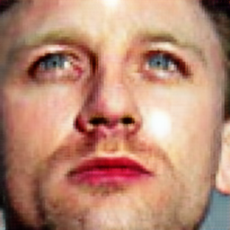
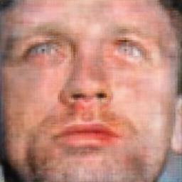

# Makeup Attack and Defend

This repository is an extension of the original [MakeupAttack](https://github.com/AaronSun2000/MakeupAttack) project. It introduces a **novel defense mechanism** using **UNet + PatchGAN** to effectively remove adversarial makeup from face images before recognition. Additionally, it includes a **transferability study** using BeautyGAN trained on the PubFig dataset to generate diverse and realistic adversarial examples.

---

## 🚀 Project Overview

- **MakeupAttack**: Implements adversarial makeup attacks to deceive facial recognition models.
- **Novel Defense**: A GAN model (UNet generator + PatchGAN discriminator) removes the makeup and restores the image.
- **Transferability Study**: 
  - BeautyGAN trained on **PubFig dataset** to apply makeup transformations.
  - Defense GAN evaluated on these transformed images for robustness.

---

## 📂 Directory Structure

```
makeup_attack_and_defend/
├── makeup_removal/                  # UNet + PatchGAN based makeup removal GAN
|--|-- models/
|--|-- inference.py/
|--|-- train.py/
|--|-- utils.py/
├── beautygan_attack/         # Transferability test 
├──|-- data/                 # Scripts and loaders 
├──|-- models/                  
├──|-- utils/    
├── utils/                    # Utility scripts
└── README.md
```

---

## 🛠️ Key Contributions

### ✅ UNet + PatchGAN Defense

- A conditional GAN that removes makeup from adversarial images.
- UNet architecture preserves facial structure while removing perturbations.
- PatchGAN discriminator ensures high-frequency texture consistency.

### 🔄 Transferability Evaluation

- Trained BeautyGAN on **PubFig** to create realistic makeup styles.
- Defense GAN successfully removes makeup added by both:
  - Original MakeupAttack
  - BeautyGAN (cross-method generalization)

---

## 📦 Setup Instructions

### 1. Clone the Repository

```bash
git clone https://github.com/Sandeep-4469/makeup_attack_and_defend.git
cd makeup_attack_and_defend
```

### 2. Install Dependencies

```bash
#creating virtual env (conda)
conda env create -f environment.yml
conda activate mup
```

### 3. Prepare Datasets

- Use CelebA dataset for training the attack and defense models.
- Use PubFig dataset for training BeautyGAN and evaluating transferability.

Place the datasets inside the `datasets/` folder.

---

## 🧪 Training & Inference

### Train the Defense GAN

```bash
cd makeup_removal
python train.py
```

### Run Inference with the Defense GAN

```bash
python inference.py
```

### Generate Transferable Attacks using BeautyGAN

```bash
cd makeup_attack
python train_beautygan.py --dataroot_A ./data/non-makeup     --dataroot_B ./data/makeup     --name beautygan_makeup_run     --model cycle_gan

python test_image.py # for testing attack on image
```

### Defend Against BeautyGAN Attacks

```bash
cd ../makeup_removal
python inference.py
```

---

## 📈 Results

### Example

| Original Image | After Makeup Attack | After Defense |
|----------------|---------------------|----------------|
|  |  |  |

- Face recognition performance drops after makeup attack.
- UNet + PatchGAN successfully removes makeup.
- Works across multiple attack sources including BeautyGAN.

---

## 📚 References

- [MakeupAttack (Base Repo)](https://github.com/AaronSun2000/MakeupAttack)
- [BeautyGAN](https://github.com/Honlan/BeautyGAN)
- [Pix2Pix (PatchGAN)](https://arxiv.org/abs/1611.07004)
- [UNet Architecture](https://arxiv.org/abs/1505.04597)

---

## 👤 Author
**Vissapragada Sandeep (M24DS018, IIT-Bhilai)** \
GitHub: [@Sandeep-4469](https://github.com/Sandeep-4469)
---

## Co-author 
**Sugandh Kumar (M24DS016, IIT-Bhilai)**\
GitHub: [@sugandhkumar123](https://github.com/sugandhkumar123)
---
 ## Acknowledgements
 I would like to extend my sincere gratitude to the Teaching Assistants who provided invaluable support throughout the development of this project:
 - [@Sudev007](https://github.com/Sudev007)

---
